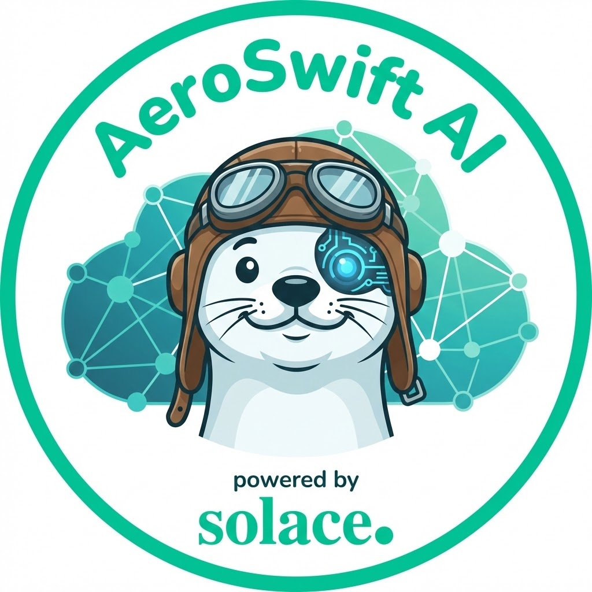

# AeroSwift AI - Airport Passenger Recognition System

<p align="center">
  
</p>

A complete real-time airport passenger recognition and boarding assistance system consisting of a camera streaming server with AI-powered people detection, a modern web application for displaying live feeds and passenger information, an event-driven AI agent mesh for passenger assistance, a facial recognition service for automated passenger identification, and a passport reader for on-the-spot passenger enrollment via MRZ OCR and NFC chip reading.

## System Overview

This project provides an end-to-end solution for airport boarding operations:

1. **Camera Streaming Server**: Captures video from ESP32 cameras, performs real-time people detection using YOLOv8, and publishes frames and analytics via Solace PubSub
2. **Web Application**: Displays live camera feeds and passenger information in a modern, responsive interface
3. **Agent Mesh**: Event-driven AI agents that provide personalized passenger assistance including flight rebooking, directions, and concierge services
4. **Facial Recognition**: Enrolls and matches passenger faces using vector similarity search against a Qdrant database
5. **Passport Reader**: Enrolls unknown passengers on the spot by reading the MRZ zone via OCR and the NFC chip via JMRTD, then publishing the verified identity to Solace and registering the face in the facial recognition service

## Architecture

```
┌─────────────────┐
│  ESP32 Camera   │
│   (Hardware)    │
└────────┬────────┘
         │ HTTP Stream
         ▼
┌─────────────────────────────┐     ┌──────────────────────────────┐
│  Camera Streaming Server    │     │   Facial Recognition         │
│  - Frame Processing         │     │  - Enroll Service (port 3001)│
│  - YOLOv8 Face Detection    │     │  - Match Service (port 3002) │
│  - MQTT Publishing          │     │  - face-api.js embeddings    │
└────────┬────────────────────┘     └──────────────┬───────────────┘
         │ Solace PubSub (MQTT)           ▲        │ Cosine Search
         ▼                                │        ▼
┌─────────────────────────────┐           │  ┌───────────────────────┐
│   Solace PubSub Broker      │           │  │   Qdrant Vector DB    │
│   (Message Router)          │           │  │   (Docker, port 6333) │
└────────┬────────────────────┘           │  └───────────────────────┘
         │ WebSocket / Event Triggers      │
         ▼                                │ Enroll (base64 + flyerId)
┌─────────────────────────────┐     ┌──────────────────────────────┐
│   AeroSwift Web App         │     │   Passport Reader            │
│   - Live Camera Feed        │     │  - MRZ OCR (Tesseract)       │
│   - Passenger Info          │◄───►│  - NFC Chip Read (JMRTD)     │
│   - PassportScanner UI      │     │  - Flask service (port 3003) │
└─────────────────────────────┘     └──────────────────────────────┘
         │
         ▼ Solace PubSub
┌──────────────────────────────┐
│   Agent Mesh (SAM)           │
│  - Orchestrator Agent        │
│  - AeroswiftOperations Agent │
│  - AeroswiftDB Agent         │
│  - FDPS Agent                │
└──────────────────────────────┘
```

## Projects

### 1. Camera Streaming Server (camera-streaming-server)

Node.js server that connects to ESP32 cameras and provides:
- Real-time video frame processing and streaming
- YOLOv8-based face detection and counting
- MQTT publishing via Solace PubSub
- RESTful API for stream control
- Frame rate limiting and optimization

**Location**: `camera-streaming-server/`

**Key Features**:
- Automatic YOLOv8 model download and initialization
- Configurable detection intervals and confidence thresholds
- Binary frame transmission for optimal performance
- Dynamic topic control
- Request-response pattern for client queries

[View Camera Server Documentation →](./camera-streaming-server/README.md)

### 2. AeroSwift Web Application (aersoswift-web-app)

Modern Svelte 5 web application that displays:
- Live camera feeds from multiple gates
- Real-time passenger information
- People detection analytics
- Boarding status and flight details

**Location**: `aersoswift-web-app/`

**Key Features**:
- Real-time video streaming via Solace WebSocket
- Responsive design with Tailwind CSS
- Demo mode for development without hardware
- **Webcam mode** (`VITE_WEBCAM_MODE=true`): uses the browser's built-in webcam as a camera source — captures frames on face detection and publishes them to Solace, enabling a full demo without an ESP32
- Automatic reconnection handling
- Custom airline-themed UI

[View Web App Documentation →](./aersoswift-web-app/README.md)

### 3. Agent Mesh (agent-mesh)

Event-driven agentic AI deployment providing personalized assistance to frequent flyers, triggered by business events such as passenger check-in. Built on [Solace Agent Mesh](https://github.com/SolaceLabs/solace-agent-mesh).

**Location**: `agent-mesh/`

**Agents**:
- **Orchestrator Agent**: Discovers peer agents, decomposes prompts, delegates tasks, and aggregates responses
- **AeroswiftOperations Agent**: Primary coordinator for frequent flyer workflows; delegates to AeroswiftDB and FDPS agents
- **AeroswiftDB Agent**: SQL agent that queries the frequent flyer SQLite database (tiers, benefits, member profiles, statuses)
- **FDPS Agent**: Accesses real-time flight information (source/destination, arrival, status)

**Key Features**:
- Flight rebooking recommendations for delayed or canceled flights
- Directions to airport lounges and points of interest
- Tier-based airport concierge service activation
- Business process automation triggered by Solace events
- Dev mode via `SOLACE_DEV_MODE=true` (no broker required)

[View Agent Mesh Documentation →](./agent-mesh/README.md)

### 4. Facial Recognition (facial-recognition)

Standalone face enrollment and matching demo using vector similarity search. Passengers are enrolled by storing face embeddings in Qdrant; live face images are matched against the database using cosine similarity.

**Location**: `facial-recognition/`

**Services**:
- **Enroll Service** (port 3001): Accepts a base64 image + flyerId, extracts a 128-d face embedding via face-api.js, and upserts it into Qdrant
- **Match Service** (port 3002): Accepts a base64 image, extracts an embedding, runs top-K cosine search in Qdrant, and returns a match decision with confidence score

**Key Features**:
- L2-normalized face embeddings via `@vladmandic/face-api` (SSD MobileNetV1)
- Cosine similarity matching in Qdrant vector database
- Confidence + gap-based match decision (recommended thresholds: confidence ≥ 0.90, gap ≥ 0.05)
- REST API for easy integration
- Docker-based Qdrant deployment

[View Facial Recognition Documentation →](./facial-recognition/README.md)

### 5. Passport Reader (passport-reader)

On-the-spot passenger enrollment pipeline. Combines webcam-based MRZ OCR with physical NFC chip reading to verify and register a passenger's identity, then stores a face embedding in Qdrant via the facial recognition enroll service.

**Location**: `passport-reader/`

**How it works**:
1. An operator initiates enrollment — the passenger holds their passport up to the webcam — Tesseract OCR extracts the Machine Readable Zone (two lines of ICAO TD-3 text containing passport number, DOB, expiry, name)
3. The agent reads the NFC chip (via an ACR122U USB reader and JMRTD Java library) using the OCR data as the BAC key, retrieving the DG1 identity record and the DG2 facial photo
4. OCR data is cross-validated against the NFC chip data; mismatches are flagged to the operator
5. The extracted photo is base64-encoded and POSTed to the facial recognition enroll service (port 3001), storing a face embedding in Qdrant
6. An enrollment event is published to Solace and a gate camera reset is triggered so the next face scan can match the newly enrolled passenger

**Services**:
- **Flask HTTP Service** (`passport_service.py`, port 3003): Browser-driven endpoints for the Svelte UI — `POST /ocr`, `POST /nfc`, `GET /nfc/status`, `POST /enroll`
- **Standalone Script** (`complete_passport_reader.py`): Terminal-driven version of the same pipeline for offline testing

**Key Features**:
- Tesseract OCR with MRZ-tuned config (`--oem 3 --psm 6`, A-Z0-9< whitelist)
- JMRTD-based NFC reading with Basic Access Control (BAC) key derivation
- Field-level OCR vs NFC validation with operator override
- PIL-based JPEG repair for truncated NFC photos
- Non-blocking NFC read with server-sent status polling
- Solace MQTT publish of `aeroswift/passenger/enrolled` on successful enrollment

**Setup**:
```bash
cd passport-reader
pip install opencv-python pytesseract flask flask-cors paho-mqtt Pillow requests
# Also requires: Tesseract OCR, Java runtime, ACR122U NFC reader (or compatible)
python passport_service.py   # Runs on port 3003
```

[View Passport Reader Documentation →](./passport-reader/README.MD)

## Quick Start

### Prerequisites

- Node.js v18 or higher
- Python 3.12+ (for Agent Mesh and Passport Reader)
- Java runtime (for Passport Reader NFC support)
- Docker (for Qdrant vector database)
- ESP32 camera module (or use demo mode)
- Solace PubSub broker (cloud or local)
- Tesseract OCR (for Passport Reader)
- ACR122U USB NFC reader or compatible (for Passport Reader)

### 1. Configure shared environment

```bash
cp common-properties/.env.example common-properties/.env
# Edit common-properties/.env with your Solace broker credentials
```

### 2. Start Qdrant

```bash
docker run -d --name qdrant -p 6333:6333 qdrant/qdrant
curl -X PUT http://localhost:6333/collections/flyers \
  -H "Content-Type: application/json" \
  -d '{"vectors": {"size": 128, "distance": "Cosine"}}'
```

### 3. Start all core services with one command

```bash
npm install   # install root tooling (first time only)
npm start
```

This single command will:
1. Copy each subproject's `.env.example` → `.env` (skipped if `.env` already exists)
2. Run `npm install` in `camera-streaming-server`, `aersoswift-web-app`, and `facial-recognition/match-service`
3. Start all three services concurrently with color-coded, labeled output:
   - **camera** — Camera Streaming Server (`node server.js`)
   - **web** — AeroSwift Web App (`vite --host 0.0.0.0`)
   - **face-match** — Facial Recognition Match Service (`node solace-app.js`)

### 4. Start Enroll Service (required for passport enrollment)

```bash
cd facial-recognition/enroll-service && node index.js
```

### 5. Start Passport Reader Service (optional — needed for unknown passenger enrollment)

```bash
cd passport-reader
source nfc-env/bin/activate   # activate Python virtual environment
python passport_service.py    # runs on port 3003
```

### 6. Access the Application

Open your browser to `http://localhost:5173` to view the web application.

---

### Optional: Agent Mesh

```bash
cd agent-mesh
python -m venv .venv && source .venv/bin/activate
pip install solace-agent-mesh
sam init --skip
./setup.sh

# Configure environment
cp .env_sample .env
# Edit .env with your LLM endpoint and Solace credentials

sam run          # foreground
nohup sam run &  # background
```

The Agent Mesh UI is available at `http://localhost:8000`.

---

## Topics and Message Flow

All topic names are defined in `common-properties/.env.example` and loaded by each service at startup. The values below are the defaults.

### Video Stream
- **Topic**: `aeroswift/terminal1/v1/camera/stream`
- **Publisher**: Camera Streaming Server
- **Subscriber**: Web App
- **Format**: Binary (`frameId|timestamp|frameSize|JPEG bytes`)
- **QoS**: 0

### Camera Analytics
- **Topic**: `aeroswift/terminal1/v1/camera/analytics`
- **Publisher**: Camera Streaming Server
- **Subscriber**: Web App
- **Format**: JSON (face count, bounding boxes, confidence scores, frame dimensions)
- **QoS**: 1

### Face Match Request
- **Topic**: `aeroswift/terminal1/v1/face/match/request`
- **Publisher**: Camera Streaming Server
- **Subscribers**: Web App (display), `FACE.MATCH.QUEUE` (processing)
- **Format**: JSON (`imageBase64`, `source`, `timestamp`)
- **QoS**: 1
- **Note**: This topic must be added as a queue subscription on `FACE.MATCH.QUEUE` in the Solace broker so the match service receives face images.

### Face Match Result
- **Topic**: `aeroswift/terminal1/v1/face/match/result`
- **Publisher**: Match Service
- **Subscribers**: Web App, Agent Mesh Gateway
- **Format**: JSON (`matched`, `flyerId`, `confidence`, `timestamp`, `messageId`)
- **QoS**: 1

### Face Match Error
- **Topic**: `aeroswift/terminal1/v1/face/match/error`
- **Publisher**: Match Service
- **Subscriber**: Web App
- **Format**: JSON (`error`, `timestamp`, `messageId`)
- **QoS**: 1

### Unrecognized Face
- **Topic**: `aeroswift/passenger/unrecognized`
- **Publisher**: Match Service
- **Subscriber**: Web App
- **Format**: JSON (`matched: false`, `flyerId: null`, `confidence`, `timestamp`)
- **QoS**: 1

### Face Scan Reset
- **Topic**: `aeroswift/terminal1/v1/face/scan/reset`
- **Publishers**: Web App (on load), Passport Reader Service (after enrollment)
- **Subscriber**: Camera Streaming Server
- **Format**: JSON (`reset: true`, `flyerId`, `timestamp`)
- **QoS**: 1

### Passenger Lookup Response
- **Topic**: `aeroswift/terminal1/v1/passenger/lookup/response`
- **Publisher**: Agent Mesh Gateway
- **Subscriber**: Web App
- **Format**: JSON (`passengerDetails`)
- **QoS**: 1

### Passenger Enrolled
- **Topic**: `aeroswift/passenger/enrolled`
- **Publisher**: Passport Reader Service
- **Subscriber**: Agent Mesh Gateway
- **Format**: JSON (`flyerId`, `enrolled`, `surname`, `givenNames`, `timestamp`)
- **QoS**: 1

### Queue: FACE.MATCH.QUEUE
- **Type**: Durable queue
- **Consumer**: Match Service (`solace-app.js`)
- **Topic subscription**: `aeroswift/terminal1/v1/face/match/request`
- **Purpose**: Guarantees at-least-once delivery of face images to the match service and ensures sequential processing.

## Configuration

### Solace PubSub Setup

Both projects require a Solace PubSub broker. You can:

1. **Use Solace Cloud** (Free tier available):
   - Sign up at https://solace.com/cloud/
   - Create a messaging service
   - Note your connection details (URL, VPN, credentials)

2. **Run Local Broker**:
   ```bash
   docker run -d -p 8008:8008 -p 1883:1883 -p 8080:8080 \
     --name=solace solace/solace-pubsub-standard
   ```

### Environment Variables

All shared configuration lives in `common-properties/.env`. Each subproject loads it automatically via `dotenv-expand`. Project-specific `.env` files may override any value.

**`common-properties/.env`**:
```env
SOLACE_HOST=localhost
SOLACE_WS_PORT=8008
SOLACE_MQTT_PORT=1883
SOLACE_VPN=default
SOLACE_USERNAME=default
SOLACE_PASSWORD=default

TOPIC_VIDEO_FEED=aeroswift/terminal1/v1/camera/stream
TOPIC_ANALYTICS=aeroswift/terminal1/v1/camera/analytics
TOPIC_FACE_MATCH_REQUEST=aeroswift/terminal1/v1/face/match/request
TOPIC_FACE_MATCH_RESULT=aeroswift/terminal1/v1/face/match/result
TOPIC_FACE_MATCH_ERROR=aeroswift/terminal1/v1/face/match/error
TOPIC_FACE_SCAN_RESET=aeroswift/terminal1/v1/face/scan/reset
TOPIC_PASSENGER_LOOKUP_RESPONSE=aeroswift/terminal1/v1/passenger/lookup/response
```

**Camera Server** (`camera-streaming-server/.env`):
```env
ESP32_CAMERA_IP=192.168.40.169
ESP32_STREAM_PORT=81
ESP32_STREAM_PATH=/stream
ENABLE_FACE_DETECTION=true
DETECTION_INTERVAL_MS=2000
DETECTION_CONFIDENCE_THRESHOLD=0.5
FACE_MODEL_TYPE=yolov8n-face
ENABLE_EMOTION_DETECTION=true
```

**Web App** (`aersoswift-web-app/.env`):
```env
VITE_DEMO_MODE=false
VITE_WEBCAM_MODE=false   # set to true to use browser webcam instead of ESP32
```

**Agent Mesh** (`agent-mesh/.env`):
```env
LLM_SERVICE_ENDPOINT=""
LLM_SERVICE_API_KEY=""
LLM_SERVICE_GENERAL_MODEL_NAME=""
SOLACE_BROKER_URL=""
SOLACE_BROKER_VPN=""
SOLACE_BROKER_USERNAME=""
SOLACE_BROKER_PASSWORD=""
SOLACE_DEV_MODE=false
AEROSWIFT_DB_TYPE=sqlite
AEROSWIFT_DB_NAME=data/aeroswift.db
```

## Demo Mode

**Web App (animated)**: Set `VITE_DEMO_MODE=true` to generate an animated video feed without a Solace connection.

**Web App (webcam)**: Set `VITE_WEBCAM_MODE=true` to use the browser's webcam as the camera source. The `WebcamPublisher` component runs face detection via `@vladmandic/face-api` (TinyFaceDetector) at 500 ms intervals and publishes captured JPEG frames to the face match request topic over Solace. This mode works alongside a live Solace broker and facial recognition services, making it useful for demos without physical ESP32 hardware.

**Camera Server**: Run without ESP32 connection — the server will attempt to reconnect automatically.

## Development

### Camera Server Development

```bash
cd camera-streaming-server
npm run dev  # Uses nodemon for auto-restart
```

### Web App Development

```bash
cd aersoswift-web-app
npm run dev  # Vite dev server with HMR
```

## Production Deployment

### Camera Server

```bash
cd camera-streaming-server
npm start
# Or use PM2 for process management:
pm2 start server.js --name camera-server
```

### Web App

```bash
cd aersoswift-web-app
npm run build
npm run preview  # Test production build
# Deploy dist/ folder to your web server
```

## Hardware Requirements

### ESP32 Camera Module

Recommended models:
- ESP32-CAM (AI-Thinker)

The ESP32 should serve MJPEG stream on `/stream` endpoint (port 81) and still images on `/capture` (port 80).

### NFC Chip Reader (Passport Reader)

Required for reading the NFC chip embedded in ICAO-compliant biometric passports.

Recommended device:
- **ACR122U** USB NFC reader (most common, well-supported by JMRTD)

The reader must support **ISO 14443** (Type A/B) contactless smartcard protocols. The JMRTD Java library communicates with the reader via the PC/SC stack — ensure `pcscd` (Linux/macOS) or the built-in Windows SmartCard service is running before starting `passport_service.py`.

## Performance Optimization

### Frame Rate Control

Adjust in camera server `.env`:
```env
MAX_FPS=10
MIN_FRAME_INTERVAL_MS=100
```

### Detection Optimization

```env
DETECTION_INTERVAL_MS=2000
DETECTION_CONFIDENCE_THRESHOLD=0.5
```

## Troubleshooting

### Camera Server Issues

**ESP32 Connection Failed**:
- Verify ESP32 IP address and network connectivity
- Check ESP32 is serving stream on correct port/path
- Test with browser: `http://<ESP32_IP>:81/stream`

**YOLOv8 Model Issues**:
- Ensure Python and ultralytics are installed
- Run `python export-yolo-model.py` manually
- Check `models/` directory for .onnx file

**Solace Connection Failed**:
- Verify broker URL and credentials in `common-properties/.env`
- Check firewall rules for MQTT port (1883)

### Web App Issues

**Video Not Displaying**:
- Check browser console for errors
- Verify Solace WebSocket connection
- Confirm `TOPIC_VIDEO_FEED` matches between camera server and web app
- Try `VITE_DEMO_MODE=true` to isolate issue

**Build Errors**:
```bash
rm -rf node_modules package-lock.json
npm install
```

### Passport Reader Issues

**NFC read fails immediately**:
- Make sure passport is flat on the reader
- Check that `pcscd` is running: `sudo pcscd --foreground`
- Verify the ACR122U is detected: `pcsc_scan`

## Monitoring

### Camera Server Logs

The server provides detailed logging:
- Connection status
- Frame rate statistics
- Detection results
- MQTT publish status

### Web App Console

Open browser DevTools to see:
- Solace connection events
- Received messages
- Frame processing logs

## Security Considerations

1. **Credentials**: Never commit `.env` files to version control
2. **Network**: Use TLS/SSL for production Solace connections
3. **Authentication**: Implement proper authentication for web app
4. **Camera Access**: Secure ESP32 cameras on isolated network
5. **CORS**: Configure appropriate CORS policies

## License

MIT

## Support

For issues and questions:
- Camera Server: See [camera-streaming-server/README.md](./camera-streaming-server/README.md)
- Web App: See [aersoswift-web-app/README.md](./aersoswift-web-app/README.md)
- Agent Mesh: See [agent-mesh/README.md](./agent-mesh/README.md)
- Facial Recognition: See [facial-recognition/README.md](./facial-recognition/README.md)
- Passport Reader: See [passport-reader/README.MD](./passport-reader/README.MD)

## Contributing

Contributions are welcome! Please:
1. Fork the repository
2. Create a feature branch
3. Make your changes
4. Submit a pull request

## Acknowledgments

- **Solace PubSub** for real-time messaging infrastructure
- **Solace Agent Mesh** for the event-driven agentic AI framework
- **YOLOv8** (Ultralytics) for state-of-the-art object detection
- **@vladmandic/face-api** for face detection and recognition
- **Qdrant** for high-performance vector similarity search
- **Svelte** for reactive UI framework
- **ESP32** community for camera module support
